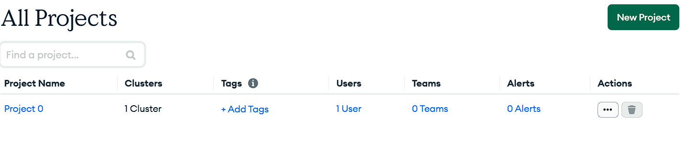
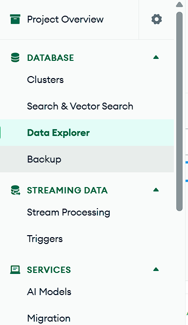
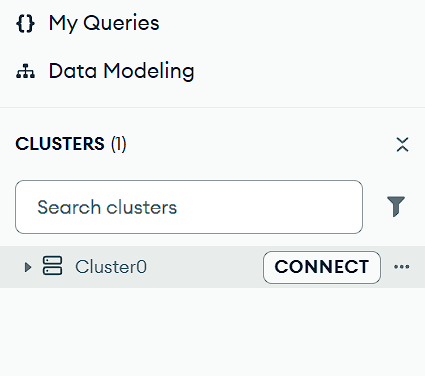
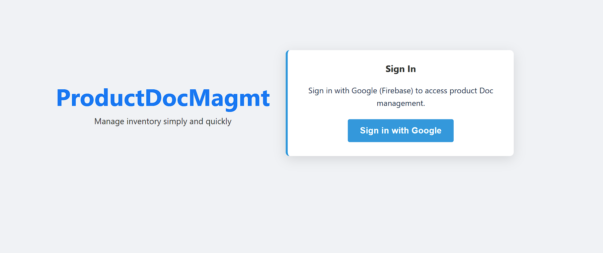

# Product Doc Management System

A modern, full-stack product management application built with FastAPI REST API, MongoDB database, Vue.js-powered web GUI, and comprehensive test coverage. Features client-side Firebase authentication, Docker containerization, and professional UI/UX.

## Features

- ✅ Complete CRUD operations (Create, Read, Update, Delete)
- ✅ Advanced search with multi-field support and regex queries
- ✅ Pagination with configurable limits
- ✅ Column sorting (ascending/descending)
- ✅ MongoDB integration with async Motor driver
- ✅ Client-side Firebase authentication (optional)
- ✅ Responsive web GUI with professional styling
- ✅ Docker and Docker Compose support
- ✅ Comprehensive unit and integration tests
- ✅ API documentation with Swagger UI
- ✅ Structured error handling with detailed responses
- ✅ Environment-driven configuration
- ✅ Database seeding with sample data

## Tech Stack

| Component | Technology |
|-----------|-----------|
| **Backend** | Python 3.12, FastAPI, Uvicorn |
| **Database** | MongoDB with Motor (async driver) |
| **Frontend** | HTML5, CSS3, Vanilla JavaScript |
| **Authentication** | Firebase Authentication (optional) |
| **Validation** | Pydantic v2 |
| **Testing** | pytest, pytest-asyncio, httpx |
| **Containerization** | Docker + Docker Compose |
| **Package Manager** | UV |

## Project Structure

```
.
├── app/
│   ├── main.py             # FastAPI app setup and routes
│   ├── database.py         # MongoDB client configuration
│   ├── models.py           # Pydantic models and validation
│   ├── crud.py             # Database operations (CRUD)
│   ├── auth.py             # Firebase token verification (optional)
│   ├── routers/
│   │   └── products.py     # Product API endpoints
│   ├── templates/          # Jinja2 HTML templates
│   │   ├── base.html       # Base layout template
│   │   ├── index.html      # Product list page
│   │   ├── create.html     # Create product form
│   │   ├── update.html     # Update product form
│   │   ├── search.html     # Search page
│   │   └── login.html      # Firebase login page
│   ├── static/
│   │   ├── css/
│   │   │   └── styles.css  # Styling
│   │   └── js/
│   │       ├── app.js      # Frontend logic
│   │       ├── app-auth.js # Firebase auth handling
│   │       └── firebase-config.js  # Firebase config (user-provided)
│   └── __init__.py
├── tests/                  # Test suite
│   ├── conftest.py         # Pytest configuration and fixtures
│   ├── test_models.py      # Model validation tests
│   ├── test_crud.py        # CRUD operation tests
│   ├── test_api.py         # API endpoint integration tests
│   └── __init__.py
├── seed_db.py              # Database seeding script
├── pyproject.toml          # Project metadata (UV)
├── pytest.ini              # Pytest configuration
├── requirements.txt        # Python dependencies
├── Dockerfile              # Container build instructions
├── compose.yml             # Docker Compose configuration
├── .env                    # Environment variables
├── .dockerignore            # Docker build ignore
└── README.md               # This file
```

## Quick Start

### Prerequisites

- Docker & Docker Compose (recommended) [install docker](https://docs.docker.com/desktop/setup/install/windows-install/)
- Or: Python 3.12 + MongoDB local installation
- Git

### Option 1: Docker (Recommended)

1. **Clone and configure**:

```bash
git clone <repository>
cd Doc_Management_System
```

2. **Run with Docker Compose**:
  -  It will  use the mongodb image

```bash
docker compose up --build 
```
**run in detach mode**
```bash
docker compose up --build -d
```
- Use Mongo cloud 
[follow the tutorial](https://www.google.com/search?q=create+a+mongodb+atlas+account&oq=create+a+mongo+db+a&gs_lcrp=EgZjaHJvbWUqCQgBEAAYDRiABDIGCAAQRRg5MgkIARAAGA0YgAQyCAgCEAAYFhgeMggIAxAAGBYYHjIICAQQABgWGB4yCAgFEAAYFhgeMggIBhAAGBYYHjIGCAcQRRg80gEJMTAwMDFqMGo3qAIAsAIA&sourceid=chrome&ie=UTF-8#fpstate=ive&vld=cid:bfe76795,vid:7a2Nns23d_s,st:0)
1. [Signup on mongo DB atlas](https://www.mongodb.com/cloud/atlas/register)
2. create project

3. click on Data explorer


4. click on connect

5. create database [document_management_system]
6. create collection [documents]
7. click on three dot :
select connect via 
8. then click on driver
9. create database user and password
10. add the details in .env file replace with your crediential

```bash
MONGODB_HOST=YOUR_HOST_NAME
DATABASE_NAME=document_management_system
COLLECTION_NAME=documents
MONGO_INITDB_ROOT_USERNAME=USERNAME
MONGO_INITDB_ROOT_PASSWORD=PASSWORD
```


🔹 Authentication
🔐 Firebase Console
👉 https://console.firebase.google.com/

1. Login to firebase  console
2. create a project
3. click on add app
4. enter name for app and click check box to registered the app
5. click on save
6. on left side click on Authentication
7. click on sign-in method 
8. enable google sign in method and click save
9. It will generate the project specific cofiguartion look like below

```bash
window.FIREBASE_CONFIG = {
    apiKey: "YOUR_API_KEY",
    authDomain: "YOUR_PROJECT_ID.firebaseapp.com",
    projectId: "YOUR_PROJECT_ID",
    storageBucket: "YOUR_PROJECT_ID.appspot.com",
    messagingSenderId: "YOUR_MESSAGING_SENDER_ID",
    appId: "YOUR_APP_ID"
};
```
10. copy the above configuration and paste in `app/static/js/firebase-config.js` file


### Option 2: Local Installation(each services)
1. **Install dependencies**:

```bash
uv sync
```
OR
```bash
pip install -r requirements.txt
```


2. **Configure MongoDB**:

Create `.env` file:
this is sample file add your own credential
```env
MONGODB_HOST=localhost:27017
DATABASE_NAME=document_management_system
MONGO_INITDB_ROOT_USERNAME=admin
MONGO_INITDB_ROOT_PASSWORD=secret123
COLLECTION_NAME=products
```


3. **Start the server**:

```bash
uv run uvicorn app.main:app --reload
```
OR
```bash
docker build -t fastapi-app .

docker run -d --name my-app --env-file .env -p 8000:8000 fastapi-app

```
use docker desktop to check logs and status of container

Open `http://localhost:8000` in your browser.


## API Endpoints

Base URL: `http://localhost:8000/api/v1/products`

### Create Product
- **POST** `/`
- **Request**:
  ```json
  {
    "name": "SSD 1TB",
    "category": "Storage",
    "description": "Fast NVMe SSD",
    "price": 109.99,
    "discount": 10,
    "thumbnail_url": "https://example.com/image.jpg"
  }
  ```
- **Response**: `201 Created` + product object with auto-generated `id`

### List Products
- **GET** `/?skip=0&limit=10&sort_field=name&sort_order=asc`
- **Query Parameters**:
  - `skip` (int): Number of products to skip (default: 0)
  - `limit` (int): Max products per page (default: 10, max: 100)
  - `sort_field` (enum): `name`, `category`, `price`, `discount` (default: `name`)
  - `sort_order` (enum): `asc` or `desc` (default: `asc`)
- **Response**: `200 OK`
  ```json
  {
    "total": 50,
    "skip": 0,
    "limit": 10,
    "products": [...]
  }
  ```

### Get Single Product
- **GET** `/{product_id}`
- **Response**: `200 OK` + product object
- **Error**: `404 Not Found` if product doesn't exist

### Update Product
- **PUT** `/{product_id}`
- **Request**: Partial object with fields to update
  ```json
  {
    "price": 99.99,
    "discount": 15
  }
  ```
- **Response**: `200 OK` + updated product object
- **Errors**: `404 Not Found`, `400 Bad Request` (validation error)

### Delete Product
- **DELETE** `/{product_id}`
- **Response**: `204 No Content` (or `200 OK` with message)
- **Error**: `404 Not Found`

### Search Products
- **GET** `/search/?q=keyword&field=name`
- **Query Parameters**:
  - `q` (string, required): Search query
  - `field` (enum, optional): `name`, `category`, `description` (searches all if omitted)
- **Response**: `200 OK` + array of products matching query
- **Case-insensitive** regex search

## GUI Routes

| Route | Purpose |
|-------|---------|
| `/` | Product list with pagination and sorting |
| `/create` | Form to add new product |
| `/update/{product_id}` | Form to edit product |
| `/search` | Search interface |
| `/login` | Firebase authentication page |

## Running Tests

### Setup

Install test dependencies:

```bash
uv sync  # Already includes pytest packages
```

### Run All Tests

```bash
pytest
```

### Run Specific Test Suite

```bash
pytest tests/test_models.py      # Model validation tests
pytest tests/test_crud.py        # CRUD operation tests
pytest tests/test_api.py         # API endpoint tests
```

### Run with Verbose Output

```bash
pytest -v
```

### Run with Coverage Report

```bash
pytest --cov=app --cov-report=html
```

### Test Categories

1. **Model Validation Tests** (`test_models.py`)
   - Pydantic model validation
   - Field constraints (price > 0, valid URLs, etc.)
   - Error handling for invalid inputs

2. **CRUD Operation Tests** (`test_crud.py`)
   - Create product (auto ID, custom ID)
   - Read products (single, list, pagination, sorting)
   - Update products (full, partial)
   - Delete products
   - Search operations
   - Integration tests for full CRUD cycle

3. **API Endpoint Tests** (`test_api.py`)
   - HTTP response status codes
   - Request/response validation
   - Error responses
   - GUI route availability
   - Parameter validation

## Error Handling

All API errors return consistent JSON responses:

```json
{
  "error": "validation_error|not_found|internal_server_error",
  "message": "Human-readable error description",
  "code": "ERROR_CODE",
  "details": [
    {
      "field": "field_name",
      "message": "Specific field error",
      "code": "FIELD_ERROR_CODE"
    }
  ],
  "timestamp": "2024-01-01T00:00:00"
}
```

### Common HTTP Status Codes

| Code | Meaning | Example |
|------|---------|---------|
| 200 | Success (GET, PUT) | Product retrieved/updated |
| 201 | Created | Product created successfully |
| 204 | No Content | Product deleted successfully |
| 400 | Bad Request | Invalid payload, validation failed |
| 404 | Not Found | Product doesn't exist |
| 409 | Conflict | Duplicate product ID |
| 422 | Unprocessable Entity | Invalid request format |
| 500 | Internal Server Error | Unexpected server error |

## Environment Variables

Create a `.env` file in the project root:

```env
# MongoDB Configuration
MONGODB_HOST=localhost:27017
DATABASE_NAME=document_management_system
COLLECTION_NAME=products
MONGO_INITDB_ROOT_USERNAME=admin
MONGO_INITDB_ROOT_PASSWORD=secret123

# Firebase (Optional)
FIREBASE_SERVICE_ACCOUNT=/path/to/serviceAccount.json
```

## Firebase Authentication (Optional)

The system supports optional client-side Firebase authentication:

1. **Create a Firebase Project**:
   - Go to [Firebase Console](https://console.firebase.google.com/)
   - Create a new project
   - Enable Google Sign-In (or other providers)

2. **Configure Firebase SDK**:
   - Copy your Firebase Web SDK config
   - Populate `app/static/js/firebase-config.js`:
     ```javascript
     export const firebaseConfig = {
       apiKey: "YOUR_API_KEY",
       authDomain: "your-project.firebaseapp.com",
       projectId: "your-project-id",
       storageBucket: "your-project.appspot.com",
       messagingSenderId: "123456789",
       appId: "1:123456789:web:abcdef123456"
     };
     ```

3. **Optional: Server-side Verification**:
   - If using server-side token verification, set `FIREBASE_SERVICE_ACCOUNT` env var
   - Note: Currently disabled in backend; API endpoints remain open

## Example cURL Requests

### Create a product
```bash
curl -X POST "http://localhost:8000/api/v1/products/" \
  -H "Content-Type: application/json" \
  -d '{
    "name": "Wireless Mouse",
    "category": "Peripherals",
    "description": "Bluetooth wireless mouse",
    "price": 29.99,
    "discount": 5
  }'
```

### List products with sorting
```bash
curl "http://localhost:8000/api/v1/products/?skip=0&limit=5&sort_field=price&sort_order=desc"
```

### Search products
```bash
curl "http://localhost:8000/api/v1/products/search/?q=keyboard&field=name"
```

### Update product
```bash
curl -X PUT "http://localhost:8000/api/v1/products/{product_id}" \
  -H "Content-Type: application/json" \
  -d '{"price": 24.99}'
```

### Delete product
```bash
curl -X DELETE "http://localhost:8000/api/v1/products/{product_id}"
```

## Troubleshooting

### MongoDB Connection Failed
- Ensure MongoDB is running and accessible at `MONGODB_HOST`
- Verify credentials in `.env`
- Check Docker Compose logs: `docker compose logs mongodb`

### Port Already in Use
- Change ports in `compose.yml` or run app on different port:
  ```bash
  uv run uvicorn app.main:app --port 8001
  ```

### Tests Failing
- Ensure MongoDB is running
- Check `.env` configuration
- Run with verbose output: `pytest -v -s`

### Firebase Sign-In Not Working
- Verify Firebase config in `firebase-config.js`
- Check browser console for errors
- Ensure Firebase project allows localhost origin

## Development

### Code Structure
- **Models** (`models.py`): Pydantic schemas for validation
- **CRUD** (`crud.py`): Database operations
- **Routes** (`routers/products.py`): Endpoint handlers
- **Database** (`database.py`): MongoDB connection
- **Frontend** (`templates/`, `static/`): User interface

### Adding New Features
1. Define Pydantic model in `models.py`
2. Implement CRUD operation in `crud.py`
3. Add route in `routers/products.py`
4. Create tests in `tests/`
5. Update templates/frontend if needed

### Linting & Code Quality
- Use consistent formatting and type hints
- Write descriptive docstrings
- Keep functions focused and modular

## Deployment

### Docker Production Build
```bash
docker build -t product-mgmt:latest .
docker run -p 8000:8000 \
  -e MONGODB_HOST=prod-mongodb:27017 \
  -e DATABASE_NAME=doc_system \
  -e MONGO_INITDB_ROOT_USERNAME=admin \
  -e MONGO_INITDB_ROOT_PASSWORD=secure_password \
  product-mgmt:latest
```

### Using Kubernetes (Example)
- Create ConfigMap for `.env` variables
- Create Secret for sensitive credentials
- Deploy app and MongoDB services
- Expose app via Service/Ingress

## Performance Considerations

- **Database Indexing**: Add indexes on frequently searched fields (name, category)
- **Pagination**: Always use pagination to limit data transfer
- **Caching**: Consider adding Redis for frequently accessed products
- **Connection Pooling**: Motor handles async connection pooling automatically

## Security Notes

- **Never commit** `.env` or Firebase credentials to version control
- **Use secrets managers** (AWS Secrets Manager, HashiCorp Vault) in production
- **Enable HTTPS** in production
- **Validate all inputs** (Pydantic handles this)
- **Rate limiting**: Consider adding rate limiting in production
- **CORS**: Configure CORS appropriately for frontend origin

## Contributing

1. Fork the repository
2. Create a feature branch: `git checkout -b feature/your-feature`
3. Write tests for new functionality
4. Ensure all tests pass: `pytest`
5. Commit your changes
6. Push to branch and create Pull Request

## License

MIT License - See LICENSE file for details

## Support

For issues, questions, or feature requests:
- Open an issue on GitHub
- Check existing documentation in `docs/`
- Review test files for usage examples

---

**Last Updated**: April 2, 2026  
**Version**: 1.0.0

Get product by ID:

```bash
curl "http://localhost:8000/api/v1/products/<id>"
```

Update product:

```bash
curl -X PUT "http://localhost:8000/api/v1/products/<id>" \
  -H "Content-Type: application/json" \
  -d '{"price":99.99}'
```

Delete product:

```bash
curl -X DELETE "http://localhost:8000/api/v1/products/<id>"
```

## License

MIT
